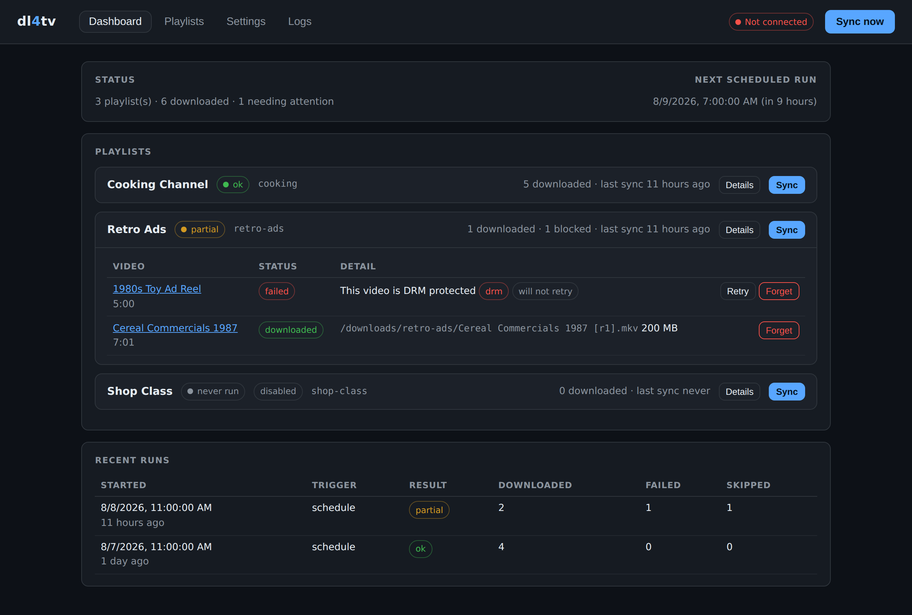

# dl4tv

**Flag a video on YouTube, watch it show up on your TV channel.**

dl4tv watches YouTube playlists you nominate, downloads anything new into a
folder you choose, and leaves the files where [ErsatzTV](https://ersatztv.org)
can pick them up. Add a video to a playlist from the YouTube app on your phone,
and by the next sync it is part of the rotation.

There is no database — everything lives in a `config.yaml` and a `state.json`
you can read, edit, back up or delete.



---

## How it works

1. You keep one YouTube playlist per channel/theme — "Cooking", "Retro Ads",
   "Shop Class", whatever. Flagging a video means adding it to that playlist
   (the *Save* button in the YouTube app).
2. In the dl4tv UI you map each playlist to a download folder. Public playlists
   need no Google account or API key.
3. On a schedule (daily at 03:00 by default) dl4tv lists each playlist, works
   out which videos it has not downloaded yet, and fetches them with
   [yt-dlp](https://github.com/yt-dlp/yt-dlp).
4. ErsatzTV scans those folders and the new videos join the channel.

Videos it cannot download — DRM, members-only, deleted, geo-blocked — are
listed in the UI with the reason, instead of being retried forever.

---

## Quick start (Docker)

```yaml
# docker-compose.yml
services:
  dl4tv:
    image: ghcr.io/sneelco/dl4tv:dev
    container_name: dl4tv
    restart: unless-stopped
    ports:
      - "8484:8484"
    environment:
      DL4TV_PUBLIC_URL: "http://localhost:8484"   # only needed for OAuth (private playlists)
    user: "1000:1000"                              # the user that owns your media
    volumes:
      - ./config:/config
      - /srv/media/youtube:/downloads              # the library ErsatzTV scans
```

```bash
docker compose up -d
```

Then open <http://localhost:8484>.

### Kubernetes / k3s

```yaml
apiVersion: apps/v1
kind: Deployment
metadata:
  name: dl4tv
spec:
  replicas: 1                     # state is flat files; do not scale this
  selector:
    matchLabels: { app: dl4tv }
  template:
    metadata:
      labels: { app: dl4tv }
    spec:
      # kubelet otherwise injects DL4TV_PORT=tcp://10.43.0.1:8484 for a Service
      # named dl4tv, which collides with dl4tv's own variable.
      enableServiceLinks: false
      securityContext:
        runAsUser: 1000           # the uid that owns your media
        runAsGroup: 1000
        fsGroup: 1000
      containers:
        - name: dl4tv
          image: ghcr.io/sneelco/dl4tv:dev
          ports:
            - { name: http, containerPort: 8484 }
          env:
            # Optional -- the same thing can be set in Settings. Needed so the
            # OAuth redirect URI matches the address you browse to, not the
            # pod's.
            - name: DL4TV_PUBLIC_URL
              value: "https://dl4tv.your-lan"
          volumeMounts:
            - { name: config, mountPath: /config }
            - { name: media, mountPath: /downloads }
          livenessProbe:
            httpGet: { path: /healthz, port: http }
            initialDelaySeconds: 10
          readinessProbe:
            httpGet: { path: /healthz, port: http }
      volumes:
        - name: config
          persistentVolumeClaim: { claimName: dl4tv-config }
        - name: media
          persistentVolumeClaim: { claimName: dl4tv-media }
---
apiVersion: v1
kind: Service
metadata:
  name: dl4tv
spec:
  selector: { app: dl4tv }
  ports:
    - { name: http, port: 8484, targetPort: http }
```

`enableServiceLinks: false` is the important line. Without it, a Service named
`dl4tv` makes kubelet set `DL4TV_PORT=tcp://10.43.0.1:8484` in the pod, which is
a URL rather than a port. dl4tv ignores such a value and logs a warning rather
than failing to start, but turning the injection off is cleaner. If you need a
non-default port and would rather not touch service links, set `DL4TV_HTTP_PORT`
— nothing injects that name.

Keep `replicas: 1`. State lives in flat files on a volume, and two replicas
would sync the same playlists twice over each other.

### Running without Docker

```bash
python -m venv .venv && . .venv/bin/activate
pip install -r requirements.txt
export DL4TV_CONFIG_DIR=./config DL4TV_DOWNLOAD_DIR=./downloads
python -m app.main
```

`ffmpeg` must be on `PATH` — it is what merges the separate video and audio
streams YouTube serves. The container image already includes it.

---

## Connecting YouTube

**Public playlists need nothing at all.** Out of the box dl4tv reads playlists
with yt-dlp — no Google account, no API key, no Cloud project, no quota. Paste a
playlist or channel URL on the Playlists tab and you are done.

Google credentials buy you exactly two things: **private playlists**, and the
**Load from YouTube** button that lists your own playlists in the UI.

### Playlist source

**Settings → Playlist source** picks where listings come from:

| Source | Needs | Sees |
|---|---|---|
| `auto` (default) | nothing | Uses the Data API when credentials exist, otherwise yt-dlp |
| `yt-dlp` | nothing | Public playlists and channels only |
| `api` | OAuth or an API key | Public playlists, plus your own private ones with OAuth |

yt-dlp scrapes the playlist page rather than calling a supported API, so it can
break when YouTube changes things — updates usually follow within days, and the
container picks them up on rebuild. It also gives slightly coarser metadata: no
upload date, and durations come from the playlist page.

The rest of this section is only relevant if you want private playlists.

### Option A — OAuth (recommended)

1. Go to the [Google Cloud console](https://console.cloud.google.com/) and
   create a project (or reuse one).
2. **APIs & Services → Library →** enable **YouTube Data API v3**.
3. **APIs & Services → OAuth consent screen**: choose *External*, fill in the
   required name/email fields, and add your own Google account under
   **Test users**. You do not need to publish or verify the app — a test user
   can use it indefinitely, though Google may expire the refresh token
   periodically, in which case just click *Connect* again.
4. **APIs & Services → Credentials → Create credentials → OAuth client ID**,
   application type **Web application**.
5. Under *Authorised redirect URIs* add exactly what dl4tv shows on its
   Settings page, e.g. `http://localhost:8484/auth/callback`. This must match
   character for character — see below if that URI looks wrong.
6. Copy the client id and secret into dl4tv's **Settings → YouTube account**,
   click **Save credentials**, then **Connect YouTube account**.

The resulting refresh token is stored in `/config/token.json` (mode `0600`).
Only the read-only scope `youtube.readonly` is requested, and the flow uses
PKCE.

Sign-in has to finish in one go: the browser round-trip is matched against the
request that started it, so if dl4tv restarts midway, or the consent page sits
open for more than 15 minutes, just click **Connect** again.

### If the redirect URI looks wrong

By default dl4tv builds the redirect URI from whatever address the request
arrived on. Behind a reverse proxy, an ingress, or a Tailscale hostname, that is
the internal address rather than the one you type — so Google is handed a
redirect it will refuse.

Set **Settings → dl4tv's URL as you browse to it** to the address you actually
use (`https://dl4tv.homelab.example`, scheme included). The Settings page then
shows the exact redirect URI to paste into your Google OAuth client.

`DL4TV_PUBLIC_URL` does the same thing from the environment and wins over the
setting, which is handy when the deployment already knows its own hostname; the
UI shows the field as env-managed in that case.

### Option B — API key

An API key uses the official API for **public** playlists without the OAuth
dance. Create one under **Credentials → Create credentials → API key** and paste
it into Settings. dl4tv cannot list your account's playlists in this mode, and
for public playlists yt-dlp already does the job with no setup — so reach for
this only if you specifically want API-backed listings.

### Quota

Quota only applies to the API source; yt-dlp has none.
The YouTube Data API gives each project 10,000 quota units per day. A sync
costs roughly 1 unit per 50 playlist items plus 1 unit per 50 new videos
inspected, so a daily sync of a few dozen playlists is nowhere near the limit.

---

## Mapping playlists to folders

Paste any of these into *Add a playlist by link* — this works with no
credentials at all:

| You paste | dl4tv uses |
|---|---|
| `https://www.youtube.com/playlist?list=PL…` | that playlist |
| `PL…` / `LL` / `UU…` | that playlist id |
| `https://www.youtube.com/@SomeChannel` | the channel's uploads |
| `https://www.youtube.com/channel/UC…` | the channel's uploads |

Folder paths are relative to `DL4TV_DOWNLOAD_DIR` (`cooking` →
`/downloads/cooking`); absolute paths are used as-is. The folder field
autocompletes against folders that already exist and tells you when the one you
typed is new — dl4tv creates it (and any missing parents) at the start of the
next sync, so a freshly mapped playlist shows up in ErsatzTV's library even
before it has downloaded anything.

With a connected Google account you also get **Playlists tab → Load from
YouTube**, which lists everything on the account — including private playlists,
your uploads and liked videos. Type a folder next to one and click **Map**.

### Per-playlist options

Expand a mapping and click **Edit**:

| Option | What it does |
|---|---|
| Folder | Where the files land |
| Format override | yt-dlp format selector just for this playlist |
| Output template override | yt-dlp output template just for this playlist |
| Max new per run | Cap downloads per sync — useful when first seeding a big playlist |
| Minimum duration | Set to `61` to skip Shorts |
| Maximum duration | Skip the three-hour podcast episodes |
| Write `.nfo` sidecar | Kodi-style metadata file next to each video |

---

## Pointing ErsatzTV at the results

In ErsatzTV, add the download folder as a **local library**. *Other Videos* is
the most forgiving type for arbitrary YouTube clips; *Music Videos* or *Shows*
work if your folder layout suits them. Scan the library, then build a
collection from it and add that collection to a channel's schedule.

Two things worth doing:

- Run dl4tv as the same uid/gid that ErsatzTV reads with (`user:` in compose),
  so new files are readable.
- Give each playlist its own folder. One folder per channel makes ErsatzTV
  collections trivial.

The `.nfo` sidecar is optional and off by default — enable it per mapping if
your library type reads NFO metadata and you want proper titles, dates and
descriptions rather than filenames.

---

## Status and errors

The dashboard shows each mapping's last sync, counts, and a live progress bar
during a run. Expand **Details** for the per-video list.

**Stop sync** appears next to the progress bar (and in the header) for as long
as a run is going — including while a big playlist is still being listed, before
any download has started. Stopping abandons the download in progress; anything
already finished is kept, and the interrupted video is simply left untried
rather than recorded as a failure. The run shows up as `cancelled`.

If a playlist turns out to be far bigger than you expected, stop the run and
then either untick **Enabled** on that mapping, or set **Max new per run** on it
so it seeds a few videos at a time.

Failures are classified so that hopeless ones stop consuming retries:

| Kind | Meaning | Retried? |
|---|---|---|
| `drm` | DRM-protected (rentals, some music) | no |
| `private` | The video is private | no |
| `unavailable` | Deleted, or the channel is gone | no |
| `members_only` | Channel-membership content | no |
| `age_restricted` | Needs a signed-in session | no — supply cookies, then Retry |
| `geo_blocked` | Not available in your region | no |
| `bot_check` | YouTube asked dl4tv to prove it is not a bot | yes — cookies usually fix it |
| `live_or_upcoming` | Premiere or live stream not finished | yes, next run |
| `no_ffmpeg` | ffmpeg is missing from the host | yes — never counts against the retry budget |
| `disk` | Out of space, or the folder is read-only | yes — never counts against the retry budget |
| `network` | Timeouts, DNS, 5xx, 403 | yes, up to *Attempts before giving up* |
| `unknown` | Anything else | yes, up to *Attempts before giving up* |

Anything marked "will not retry" has a **Retry** button that clears the flag,
and a **Forget** button that drops the record entirely so the video is treated
as new again. The **Logs** tab streams the same detail as the container logs.

### Cookies for restricted videos

Export cookies from a browser signed in to YouTube (any "Netscape format"
cookie-export extension), mount the file into the container, and set
**Settings → Downloads → Cookies file** to e.g. `/config/cookies.txt`. That
covers age-restricted videos, members-only content on channels you have joined,
and most bot checks.

---

## Locking it down

dl4tv is **open by default** — anyone who can reach the page can use it. That is
usually what you want on a home network, but it does hold a YouTube token, so
if the port is exposed anywhere less trusted, set a passphrase.

**Settings → Access**, type a passphrase twice, click *Set passphrase*. That is
the whole thing: one passphrase, no usernames, no accounts. The browser you set
it from stays signed in, and everyone else gets an unlock page.

- Only an scrypt hash goes into `config.yaml` — never the passphrase itself.
- Sessions are a signed cookie, good for 30 days, and survive a restart.
- Changing the passphrase signs every other browser out.
- **Lock** in the header forgets the current browser's session without changing
  the passphrase.
- Scripts can authenticate with HTTP basic, any username:
  `curl -u :your-passphrase http://dl4tv:8484/api/status`
- Forgot it? Delete the `security:` block from `config.yaml` and restart.

Set `DL4TV_PASSPHRASE` instead if you want the lock in place from the very first
boot — useful when the port is public before you have had a chance to configure
anything. A passphrase set that way cannot be changed or removed from the UI.

This is a single shared secret over whatever transport you put it behind. It
keeps casual visitors out; it is not a substitute for a reverse proxy with TLS
if dl4tv is genuinely internet-facing.

---

## Configuration

### Environment variables

| Variable | Default | Purpose |
|---|---|---|
| `DL4TV_CONFIG_DIR` | `/config` | Where `config.yaml`, `state.json` and `token.json` live |
| `DL4TV_DOWNLOAD_DIR` | `/downloads` | Root for relative mapping folders |
| `DL4TV_PORT` | `8484` | HTTP port. Ignored with a warning if something injects a URL here (see [Kubernetes](#kubernetes--k3s)) |
| `DL4TV_HTTP_PORT` | *(unset)* | Same thing, under a name Kubernetes never injects; wins over `DL4TV_PORT` |
| `DL4TV_HOST` | `0.0.0.0` | Bind address |
| `DL4TV_PUBLIC_URL` | *(request host)* | Base URL used to build the OAuth redirect URI. Same as the Settings field, but wins over it |
| `DL4TV_PASSPHRASE` | *(unset)* | Locks the UI before first boot; cannot be changed from the UI |
| `DL4TV_LOG_LEVEL` | `INFO` | `DEBUG` for yt-dlp detail |
| `DL4TV_OAUTH_INSECURE_TRANSPORT` | `true` | Allows a plain-http redirect URI (normal for a LAN install) |

See [Locking it down](#locking-it-down) for the passphrase.

### Files

```
/config/config.yaml   settings + playlist mappings   (edit by hand if you like)
/config/state.json    what has been downloaded, and every failure
/config/token.json    OAuth refresh token            (secret)
```

Both data files are written atomically; if one is ever unparseable it is moved
aside with an `.invalid` suffix and dl4tv carries on with defaults rather than
refusing to start. Deleting `state.json` makes dl4tv consider every playlist
video new again — it will re-download anything not already on disk.

### Download defaults

Set on the Settings tab, applied to every mapping unless overridden: format
selector, merge container, output template, embedded metadata/thumbnails,
subtitles, SponsorBlock categories to cut, rate limit, cookies file, retry
count, and a global max-new-per-run.

#### Format presets

**Settings → Downloads → Format preset** fills in the format selector and
container for you. The raw fields stay editable — change them and the dropdown
switches to *Custom*.

| Preset | Gets you | Trade-off |
|---|---|---|
| Best quality | Highest resolution available, usually VP9 or AV1 | Many TVs and set-top boxes cannot decode these |
| Most compatible | H.264 + AAC in mp4 | Capped at 1080p |
| Most compatible, 720p | The same, capped at 720p | For hardware that struggles with 1080p |

**If videos will not play on your TV, this is almost certainly why.** By
default yt-dlp takes the best available stream, which on YouTube means AV1 or
VP9 at up to 4K — formats most televisions have no decoder for. Switching to
*Most compatible* gets H.264 + AAC, which plays on essentially anything, and
lets ErsatzTV copy the video stream rather than transcode it.

The 1080p ceiling is not arbitrary: YouTube simply does not offer H.264 above
1080p, so anything higher is VP9 or AV1 by definition.

The compatible presets keep **every** fallback inside H.264-in-mp4. This
matters more than it sounds: yt-dlp will cheerfully write VP9 or AV1 into a
`.mp4` if asked, producing a file that looks correct and plays nowhere. On the
rare video with no H.264 at all, these presets fail visibly instead — the error
shows up against that video in the UI, and you can switch it to *Best quality*.

Changing this only affects **new** downloads. To re-fetch what you already
have, delete the files from the folder — dl4tv notices a downloaded video whose
file has gone missing and fetches it again on the next sync.

#### Checking what you actually got

If a file still will not play, look at what is inside it rather than at the
extension:

```bash
ffprobe -v error -show_entries stream=codec_type,codec_name,profile,width,height \
  -of default=noprint_wrappers=1 "your-video.mp4"
```

`codec_name=h264` and `codec_name=aac` is what the compatible preset should
give you. Anything else — `vp9`, `av01`, `opus` — means the file is not what its
name suggests.

---

## Container images

Published to GitHub Container Registry for `linux/amd64`:

| Tag | Built from |
|---|---|
| `ghcr.io/sneelco/dl4tv:dev` | every merge to `main` |
| `ghcr.io/sneelco/dl4tv:1.2.3` | git tag `v1.2.3` |
| `ghcr.io/sneelco/dl4tv:1.2`, `:1` | the same release, floating |
| `ghcr.io/sneelco/dl4tv:latest` | the most recent `v*.*.*` tag |

Cutting a release is just:

```bash
git tag v0.1.0 && git push origin v0.1.0
```

Pull requests build the image without publishing it.

---

## Development

```bash
python -m venv .venv && . .venv/bin/activate
pip install -r requirements.txt pytest pytest-asyncio ruff

DL4TV_CONFIG_DIR=./config DL4TV_DOWNLOAD_DIR=./downloads python -m app.main
pytest -q
ruff check app tests
```

Layout:

```
app/
  main.py        FastAPI app, lifespan, optional basic auth
  api.py         JSON API used by the UI
  sync.py        scheduler + the sync engine
  downloader.py  yt-dlp options, error classification, NFO sidecars
  sources.py     picks the playlist source (API or yt-dlp)
  youtube.py     YouTube Data API client
  ytdlp.py       credential-free playlist listing via yt-dlp
  auth.py        Google OAuth flow and token storage
  store.py       atomic YAML/JSON persistence
  models.py      pydantic models for config and state
  static/        the UI (no build step, plain HTML/CSS/JS)
```

The UI is deliberately dependency-free: no bundler, no framework, no npm.

---

## FAQ

**Does it re-download videos I delete from the folder?**
Yes. If a file recorded as downloaded is missing from disk, dl4tv fetches it
again. Use **Forget**/leave it out of the playlist if you want it gone for good,
or remove it from the playlist on YouTube.

**What if I remove a video from the playlist?**
Nothing is deleted. dl4tv only ever adds files; pruning the folder is up to you.

**Can two playlists share a folder?**
Yes, though each keeps its own download history, so a video in both playlists
is downloaded twice under the same name — yt-dlp will skip the second write.
One folder per playlist is simpler.

**Do I really not need a Google account?**
Not for public playlists. dl4tv falls back to yt-dlp, which is already installed
to do the downloading. You only need Google credentials for private playlists or
to browse your own playlists from the UI.

**Will it hammer YouTube?**
Downloads run one at a time, in playlist order, with yt-dlp's own retry
behaviour. Set a rate limit in Settings if you want to be gentler still.

---

## License

MIT
